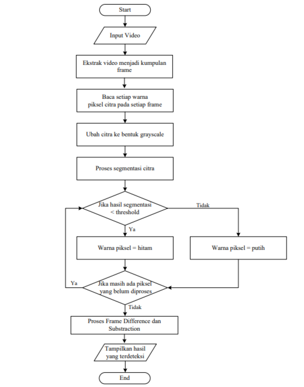
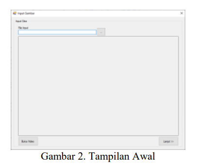
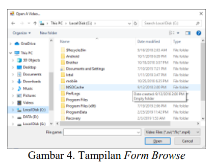
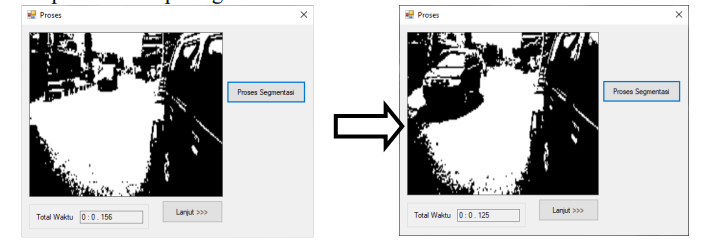
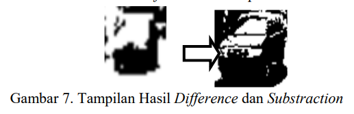
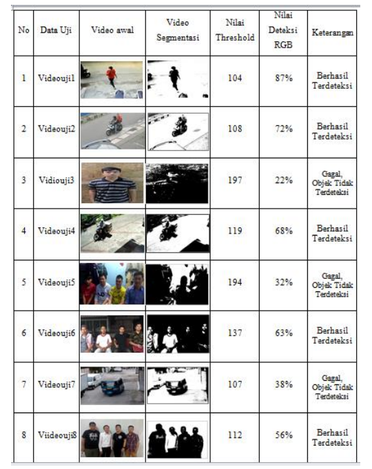
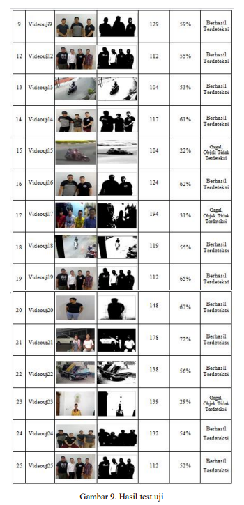

# PEMROSESAN CITRA DIGITAL
> ANGGOTA KELOMPOK: 1. ADELIA ERLYN NOR CANDRA PRASETYANA
                    2. RISMA WULANDARI

# Pengolahan Citra CCTV Pada Tilang Elektronik (Swerving & Blocking Jalur Pejalan Kaki)

### Apa itu CCTV?

**CCTV** digunakan sebagai kamera pengawas untuk mengawasi pergerakan suatu objek. Kebanyakan fungsinya hanya sebatas mengawasi secara random dan informasi yang kurang detail, hal tersebut cukup menyulitkan jika membutuhkan suatu informasi detail seperti plat nomor kendaraan, pejalan kaki, dan objek lainnya. Untuk menyelesaikan permasalahan tersebut, dapat diterapkan konsep deteksi gerakan. Deteksi gerakan digunakan untuk mengidentifikasi dan memilah objek yang diinginkan. Proses pendeteksian gerakan ini menggunakan konsep pengolahan citra _*(image processing)*_ dengan algoritma __*Frame Difference*__ dan __*Frame Substraction*__. 

 

  

 

### Algoritma Frame Difference & Substraction

 

**Algoritma Frame Difference** digunakan untuk memeriksa objek-objek pada citra. Apabila objek terdeteksi, maka diterapkan **algoritma Frame Substraction** untuk mendeteksi posisi objek dimana data posisi dikumpul menjadi gerakan. Hasil penelitian ini cukup mampu mendeteksi objek dan pergerakannya, berdasarkan hasil 25 pengujian dari video yang berbeda, presentase keberhasilanya mencapai 76,0%. Kesimpulanya adalah, Metode yang digunakan cukup berhasil mendeteksi pergerakan objek dalam video berdasarkan perbedaan _*(difference)*_ yang diperoleh dari pengurangan frame sebelumnya dan frame selanjutnya.

 

> - **Algoritma Frame Difference** ini akan digunakan untuk mengecek apakah ada perbedaan antara dua buah frame yang sedang dibandingkan. Apabila terdapat perbedaan, berarti ada pergerakan objek dalam citra frame tersebut. 

> - **Algoritma Frame Substraction** akan digunakan untuk mendeteksi posisi dari objek yang bergerak tersebut. Beberapa tahapan yang diperlukan dalam melakukan proses pendeteksian gerakan ini yaitu proses grayscale, binary image, segmentasi, deteksi, pelacakan, pengenalan, dan perhitungan. Kamera yang digunakan untuk mengambil gambar haruslah tidak bergerak. 

 

### Segmentasi Citra

 

**Citra** merupakan suatu cerminan, imitasi ataupun kemiripan dari sebuah objek, sebagai tempat keluaran dalam sebuah sistem perekaman. data yang didapat biasanya bersifat optik baik berbentuk foto dan dapat pula bersifat analog berupa video seperti yang biasa ditampilkan pada layar televisi dan lain sebaainya, atau bersifat digital yang bisa langsung disimpan pada media penyimpan seperti harddisk. Segmentasi citra adalah sebuah proses pengolahan citra yang tujuannya untuk memisahkan suatu kumpulan wilayah objek dengan kumpulan wilayah pada latar belakang yang berguna agar sebuah objek mudah dianalisis.

 

# PEMBAHASAN

 

Tampilan awal dari aplikasi Implementation Motion Capture pada Kamera CCTV dengan 
Algoritma _*Frame Difference*_ dan _*Frame Substraction*_ dapat dilihat pada gambar berikut:

 

  

Untuk melakukan proses ekstraksi _*file video*_ menjadi _*frame*_, maka pemakai dapat mengklik tombol Buka Video, sehingga sistem akan menampilkan _*form Video*_ seperti terlihat pada gambar berikut:

 

  

User dapat memilih _*file*_ video yang akan diproses dengan mengklik tombol Buka Video, sehingga sistem akan menampilkan _*form Browse*_ seperti terlihat pada gambar berikut:

  

Setelah selesai melakukan proses pemilihan _*file*_ yang diinginkan, maka user dapat mengklik tombol Open, sehingga sistem akan menampilkan _*form*_ Ekstrak File Video seperti 
terlihat pada gambar berikut:

  

Setelah berhasil mengekstrak video, maka _*user*_ dapat memulai proses pendeteksian pergerakan seperti terlihat pada gambar berikut:

  

Hasil difference dan substraction dari kedua frame diatas dapat dirincikan sebagai berikut:

  

Hasil proses pendeteksian pergerakan yang diperoleh dapat dilihat pada gambar berikut:

  

Pada beberapa tes uji, proses pendeteksian gerak dilakukan terhadap 25 data untuk diuji, data tersebut memiliki background dan kondisi cahaya yang berbeda. Hasil Proses pendeteksian pergerakan dengan _*frame differance*_ dan _*frame substraction*_ dapat dilihat pada tabel berikut:

  

  

Berdasarkan hasil pengujian dari 25 data diuji pada video diatas, maka dapat diperoleh bahwa pengaruh warna background, warna objek dan kondisi cahaya akan menentukan berhasil atau tidaknya pendeteksian gerak pada video. 

Dari tabel diatas dapat dianalisis dan diketahui berapa tingkat keberhasilan dari program pendeteksian gerakakan dengan kamera cctv ini. program ini mampu melakukan proses pendeteksian gerak sebanyak 19 data dari 25 data yang diuji, sehingga presentase keberhasilan dari program ini adalah sebagai berikut:
- Akurasi = 19/25 * 100 % = 76,0 %.
- Error Rate = 6/25 * 100 % = 24,0 %

Terdapat beberapa hal yang sudah dihasilkan dan dapat dianalisis dari pengunggahan citra adalah waktu sistem untuk memproses suatu frame guna mengetahui adanya gerakan, Belum 
dapat diketahui standar batasan yang baku untuk menentukan waktu respon ideal pada sebuah sistem pengunggahan citra, waktu ideal dapat ditentukan dengan besaran delay waktu dalam 
pemrosesanya.

Indonesia mulai menerapkan sistem tilang elektronik. Sistem ini memungkinkan pelanggar aturan lalu lintas terdeteksi walaupun tidak ada polisi lalu lintas di tempat kejadian. Dengan kecanggihan teknologi, pelanggar aturan lalu lintas dapat terdeteksi lewat CCTV. Nantinya, potongan foto dari CCTV ini akan diproses oleh Artificial Intelligence dan terlihat siapa aja yang ngelanggar aturan lalu lintas. 
Lalu bagaimana _Artificial Intelligence_ memproses informasi dari kamera CCTV?

### Cara AI Memproses Informasi dari CCTV

Sebelum membahas lebih lanjut, perlu diingat bahwa artikel ini hanya membahas pelanggaran swerving (keluar dari jalur) dan membloking jalur pejalan kaki. Agar AI dapat membedakan mobil mana yang melanggar aturan lalu lintas, AI harus dapat membedakan objek mana yang disebut sebagai mobil dan objek mana yang disebut sebagai jalan. Maka dari itu, AI perlu diberi tahu kondisi awal jalan tanpa mobil, contohnya seperti ini:

Setelah AI mengetahui kondisi jalan tanpa mobil, langkah selanjutnya adalah memberitahu AI kondisi jalan yang ada mobil.
Contohnya seperti ini:

Selanjutnya, AI bertugas untuk meng substraksi gambar jalanan tanpa mobil dengan gambar yang ada mobilnya sehingga AI dapat mengetahui objek mana yang disebut sebagai mobil. Kemudian, AI siap untuk menjalankan tugasnya, yakni menentukan apakah sebuah mobil melakukan pelanggaran dengan menggunakan genetic algorithm (GA).

### Mengenal Generic Algorithm (GA)

Nama algoritma ini mencerminkan sifat si algoritma itu sendiri. GA terinspirasi dari proses evolusi alam, di mana individu individu yang dapat bertahan merupakan individu yang berevolusi dan lolos proses seleksi alam.‘Seleksi alam’ di GA ini tercermin dari ‘fitness function’ yang menunjukkan seberapa layak suatu solusi terhadap suatu permasalahan. Nantinya, individu atau kalau dalam GA disebut sebagai ‘kromosom’ dengan fitness function yang baik akan dijadikan sebagai referensi untuk proses GA selanjutnya. Dalam kata lain, fitness function akan digunakan untuk membentuk generasi selanjutnya melalui proses crossover atau ‘reproduksi’. GA akan terus memproduksi generasi baru hingga generasi terakhir yang dibentuk sudah layak dijadiin solusi permasalahan yang dicari.
Flowchart dari genetic algorithm dapat dilihat pada gambar di bawah ini:

GA sama seperti proses evolusi manusia, di mana gen yang baik bakal diturunkan ke gen generasi manusia selanjutnya. Lalu bagaimana dengan penerapan GA di kasus tilang elektronik?

## Penerapan General Algorithm dalam Tilang Elektronik

Penerapan AI untuk mengawasi lalu lintas dilakukan dengan aplikasi GA, oleh karena itu AI harus memiliki generasi pertama terlebih dahulu untuk mencari generasi yang dapat menjadi solusi permasalahan. Untuk membuat generasi pertama, gambar hitam putih dari CCTV akan dijadikan ‘kromosom’. Populasi dari kromosom ini adalah potongan gambar mobil dengan dimensi yang sama. Kemudian, kromosom akan dievaluasi menggunakan fitness function, di mana fitness function yang digunakan adalah sebagai berikut:

Fitness function di atas digunakan untuk mencari rasio pixel berwarna putih dalam kromosom atau total pixel yang menunjukkan apakah area di bawah mobil yang sedang diamati mengandung garis putih atau tidak. Garis putih ini melambangkan batas antar jalur atau jalur pejalan kaki.

Proses seleksi menggunakan fitness function ini digunakan untuk mendeteksi kromosom mana saja yang mencapai batasan tertentu untuk bisa dikatakan melakukan pelanggaran lalu lintas. Selanjutnya, kromosom-kromosom yang lolos fitness test ini akan dijadikan referensi untuk melakukan crossover/reproduksi untuk membentuk generasi baru. Proses crossover/reproduksi dilakukan dengan mengkonversikan gambar kromosom tadi ke dalam bentuk stream 20 bits. Penjelasan mengapa harus 20 bits dapat dibaca di sini:

Kemudian, setelah dikonversikan menjadi 20 bits, diambil bilangan bulat dari 1-20 secara acak untuk menentukan berapa bits yang akan diturunkan kromosom A ke generasi selanjutnya, dan sisanya diturunkan oleh kromosom B. Contohnya, bila mengambil 13 sebagai bilangan bulat acaknya, kromosom A akan menurunkan 13 bits ke ‘anak’ atau kromosom yang baru, dan 7 bits sisanya diturunkan oleh kromosom B. Ilustrasinya dapat dilihat pada gambar di bawah ini:

Setelah proses crossover/reproduksi ini selesai, generasi yang baru tercipta. Lalu, sampai kapan proses crossover ini harus dilakukan dan kapan harus berhenti membuat generasi baru? Crossover akan berhenti ketika sistem sudah dapat membedakan mana pelanggaran yang dianggap swerving dan mana yang dianggap blocking jalur pejalan kaki. Pembedanya adalah rasio pixel berwarna putih dalam kromosom untuk pelanggaran block jalur pejalan kaki lebih besar dibandingkan swerving. Hal ini dapat terjadi sebab garis putih di jalur pejalan kaki lebih banyak dibandingkan swerving yang hanya ditandai dengan satu garis.

.png)

Rasio lebih dari 0,1 menunjukkan mobil yang diamati memblok jalur pejalan kaki, sedangkan rasio diantara 0,01 sampai 0,1 dikatakan melakukan swerving.
Bila disimulasikan dan AI memproses gambar di bawah ini, apakah ia bisa mendeteksi apakah ada mobil yang melakukan pelanggaran?

Setelah 15,55 detik, AI dapat mendeteksi terdapat pickup berwarna silver yang memblok jalur pejalan kaki. 
Output nya akan muncul seperti ini:

Pada awalnya, fitness value menunjukkan nilai yang sangat memuncak, namun mulai stabil pada iterasi/pengulangan ke 10, dan memiliki fitness value 0,127.
Hal ini membuktikan pelanggaran yang terjadi adalah ngeblock jalur pejalan kaki.

Pada awalnya, fitness value menunjukkan nilai yang sangat memuncak, namun mulai stabil pada iterasi/pengulangan ke 10, dan memiliki fitness value 0,127. Hal ini membuktikan pelanggaran yang terjadi adalah ngeblock jalur pejalan kaki. Di sisi lain, crossover performance menunjukkan konvergensi di generasi ke 587, artinya bila kromosom melakukan reproduksi/crossover lagi, hasil generasi selanjutnya akan sama seperti hasil ini. Hasil konvergensi ini menunjukan bahwa solusi permasalahan didapatkan dari genetic algorithm, dalam kasus ini berupa foto pelanggaran dan keterangan jenis pelanggarannya.

