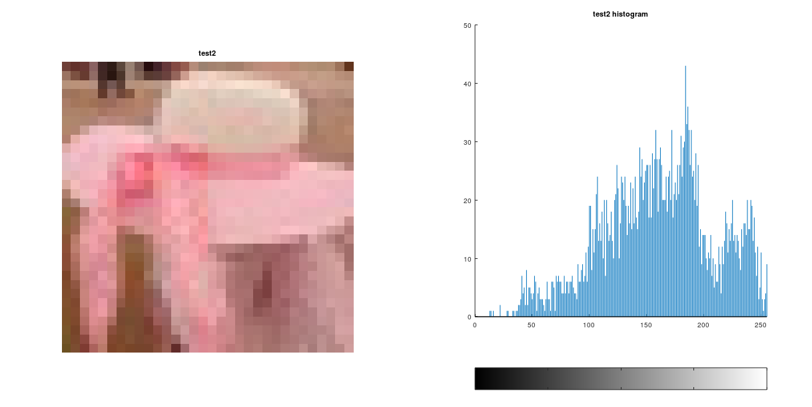
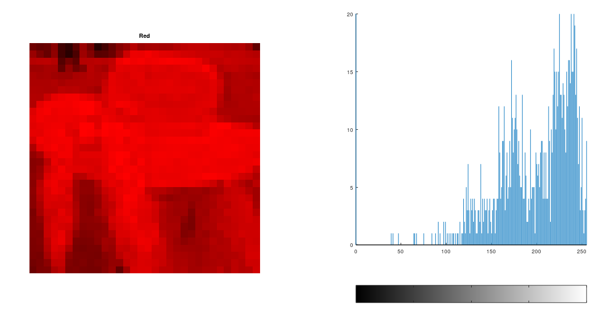
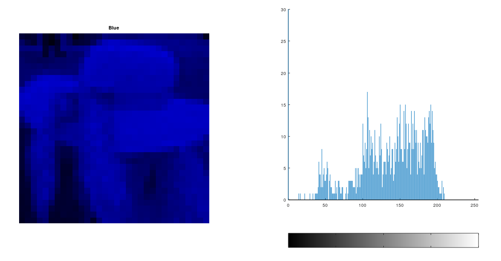

# Tugas 2

1. Silahkan mencari gambar berwarna dengan ukuran 32 X 32 dengan ekstensi PNG/JPG/JPEG dengan ukuran 32 x 32
2. Lakukan eksplorasi dengan gambar tersebut menggunakan package Image. Jika package ini belum ada silahkan kalian install terlebih dahulu.

__Pertanyaan__

1. Jelaskan ada berapa layer pada gambar berwarna! screenshot hasil ekplorasi layer pada aplikasi octave.

2. Gunakan fungsi (1) imread, (2) imshow (3) dan imhist. jelaskan fungsi2 tersebut disertakan screenshot.

__Tatacara__

* Buat catatan hasil eksplorasi di github masing2.
Catatan ditulis menggunakan mark down.
Batas Waktu hari Rabu, 21 September 2022 jam 10.00 WITA.

***

## 1. Ada 3 layer warna yaitu, Red (R), Green(G), Blue(B)

3 warna ini di dapat dengan menggunakan function package Image.<br>
Untuk setiap layer warna juga saya tampilkan histogram nya. Untuk menampilkan histogram, menggunakan __package imhist__ yang di download terlebih dahulu.

<center><b>Ini foto asli</b></center>



<center><b>Ini layer warna merah</b></center>



<center><b>Ini layer warna hijau</b></center>


<center><b>Ini layer warna biru</b></center>



File source code lengkap beserta citra pada pemrograman di atas dapat diperoleh dengan:

```Octave
gambar = imread('C:\Users\USER\Documents\KULIAH\SEMESTER 3\PCD\Tugas_Pemrosesan_Citra_Digital\Tugas2\img\test2.jpg');
imshow(gambar);
R = gambar(:,:,1);
G = gambar(:,:,2);
B = gambar(:,:,3);
Red = cat(3,R,G*0,B*0);
Green = cat(3,R*0,G,B*0);
Blue = cat(3,R*0,G*0,B);
figure(1);
subplot(1,2,1);imshow(Red);title('Red');
subplot(1,2,2),imhist(Red);
figure(2);
subplot(1,2,1);imshow(Green);title('Green');
subplot(1,2,2),imhist(Green);
figure(3);
subplot(1,2,1);imshow(Blue);title('Blue');
subplot(1,2,2),imhist(Blue);
figure(4);
subplot(1,2,1);imshow(gambar);title('test2');
subplot(1,2,2);imhist(gambar);title('test2 histogram');
```

## 2. Fungsi-Fungsi imread, imshow dan imhist
## * Fungsi imread
__Fungsi imread digunakan untuk membaca file image itu berada__

## * Fungsi imshow
__Fungsi imshow digunakan untuk menampilkan objek gambar__

## * Fungsi imhist
__Fungsi imhist digunakan untuk menampilkan image dengan bentuk histogram__