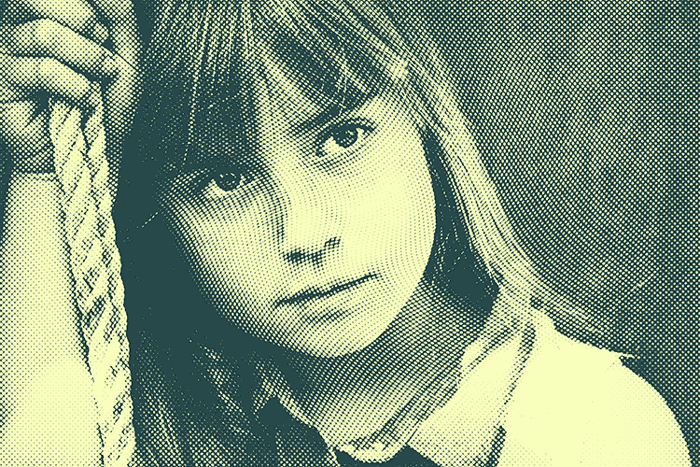
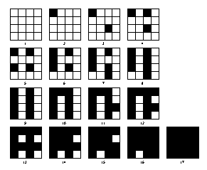
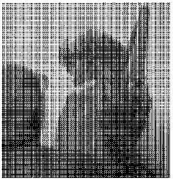
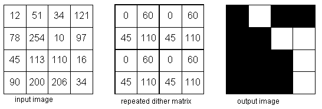
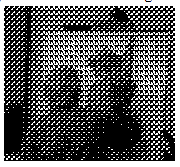

<h1 align="center">Three Algorithms for Converting Color to Grayscale</h1>

## 1. Lightness Method

Lightness Method adalah metode pertama untuk mengubah suatu gambar berwarna menjadi skala keabu-abuan dengan mengambil warna paling menonjol dan yang paling tidak menonjol sebagai nilai skala keabu-abuan. 
<b><i>Rumus Grayscale = min(R,G,B) + max(R,G,B) / 2 </i></b> 
Kelemahan dari metode ini adalah hanya mengambil sedikit sampel yaitu warna yang paling menonjol(max) dan warna yang paling tidak menonjol(min), sehingga hasil yang didapat kurang cerah / terang

## 2. Average Method

Average Method adalah metode kedua untuk mengubah gambar berwarna menjadi skala keabu-abuan dengan mengambil nilai rata-rata ketiga komponen warna (RGB) sebagai nilai skala keabu-abuan. 
<b><i>Rumus Grayscale = (R+G+B) / 3 </i></b> 
Kelemahan dari metode ini adalah mata manusia bereaksi terhadap setiap warna dengan cara yang berbeda-beda, juga mata manusia sensitif terhadap warna merah, hijau, biru. Meskipun pada metode ini mempertimbangkan semua komponen warna, tetapi memberikan bobot warna yang sama untuk setiap warnanya.

## 3. Luminosity Method

Luminosity Method adalah metode ketiga sekaligus metode terbaik untuk mengubah suatu gambar berwarna menjadi skala keabu-abuan. 
<b><i>Rumus Grayscale = (0.3*R)+(0.59*G)+(0.11*B)</i></b> 
Metode ini juga menggunaan rata-rata nilai komponen warna, tetapi membentuk rata-rata tertimbang untuk menjelaskan persepsi manusia. Sebuah penelitian ada mengatakan bahwa mata manusia lebih sensitif terhadap warna hijau daripada warna lain, jadi hijau memiliki bobot paling berat.
 

Dibawah ini contoh gambar perbedaan antara ketiga metode diatas:

Gambar 1.1 Perbandingan 3 Metode Greyscale

Berdasarkan Gambar1.1 dapat dilihat perbedaan dari ketiga metode diatas. Dimana metode luminosity memberikan hasil greyscale yang lebih terang dan jelas dibandingkan dengan 2 metode lainnya.

***
***
<h1 align="center">Halftoning: Patterning dan Dithering</h1>

## 1. Halftoning

<b>Halftone adalah</b> proses yang mensimulasikan nuansa abu-abu dengan memvariasikan ukuran titik-titik hitam kecil yang diatur dalam pola yang teratur. Halftone dapat menciptakan ilusi gambar dengan menggunakan ukuran besar kecil dot (titik) dan mampu menciptakan perbedaan antara gelap dengan terang. Haftone bekerja dengan menipu mata kita untuk melihat kombinasi warna tinta dan juga warna kain yang dicetak. Teknik ini digunakan dalam printer, serta industri penerbitan. Jika kita periksa sebuah foto di koran, kita akan melihat bahwa gambar itu terdiri dari titik-titik hitam meskipun tampaknya terdiri dari abu-abu. Hal ini dimungkinkan karena integrasi spasial yang dilakukan oleh mata kita. Mata kita memadukan detail halus dan merekam intensitas keseluruhan. Halftoning digital mirip dengan halftoning di mana gambar didekomposisi menjadi kotak sel halftone. Elemen (atau titik yang digunakan halftoning dalam mensimulasikan nuansa abu-abu) dari sebuah gambar disimulasikan dengan mengisi sel halftone yang sesuai. Semakin banyak jumlah titik hitam dalam sel halftone, semakin gelap sel tersebut. Jika dilihat dari jarak dekat, akan terliha warna yang bercampur menjadi satu dan titik-titik (dots) menyatu dengar warna dasar kain. Jika kita lihat pada jarak yang lebih dekat, akan terliha titik-titik kecil yang berbentuk bulat. Contoh halftone yang sempurna pada majalah/koran ataupun printer warna dengan melihatnya dari jarak yang sangat dekat. 

Gambar 2.1 Halftone

Dua metode umum untuk menghasilkan gambar halftoning digital yaitu <b>Patterning dan Dithring</b>. 

## 1. Patterning

Patterning / pola adalah yang paling sederhana dari tiga teknik untuk menghasilkan gambar halftoning digital. Ini menghasilkan gambar yang memiliki resolusi spasial lebih tinggi daripada gambar sumber. Jumlah sel halftone citra keluaran sama dengan jumlah piksel citra sumber. Namun, setiap sel halftone dibagi lagi menjadi kotak 4x4. Setiap nilai piksel input diwakili oleh jumlah kotak terisi yang berbeda dalam sel halftone. Karena kisi 4x4 hanya dapat mewakili 17 tingkat intensitas yang berbeda, gambar sumber harus dikuantisasi.

Gambar 2.2 Patterning

Gambar 2.3 Patterning

## 3. Dithering

Teknik lain yang digunakan untuk menghasilkan gambar halftoning digital adalah dithering. Tidak seperti pola, dithering membuat gambar keluaran dengan jumlah titik yang sama dengan jumlah piksel pada gambar sumber. Dithering dapat dianggap sebagai thresholding gambar sumber dengan matriks gentar. Matriks diletakkan berulang kali di atas gambar sumber. Dimanapun nilai piksel gambar lebih besar dari nilai dalam matriks, titik pada gambar output diisi. Masalah dithering yang terkenal adalah menghasilkan artefak pola yang diperkenalkan oleh matriks ambang batas tetap.

Gambar 2.4 Dithering

Gambar 2.5 Dithering

