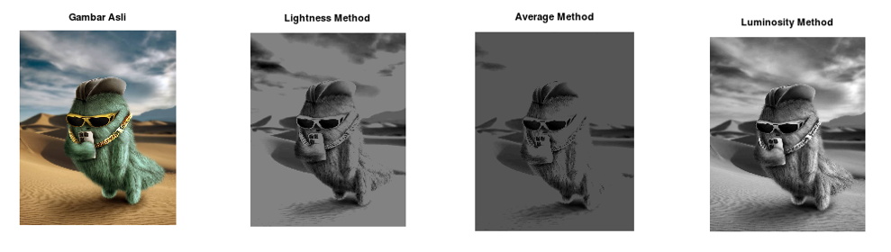

<h1 align="center">Three Algorithms for Converting Color to Grayscale</h1>

## 1. Lightness Method

Lightness Method adalah metode pertama untuk mengubah suatu gambar berwarna menjadi skala keabu-abuan dengan mengambil warna paling menonjol dan yang paling tidak menonjol sebagai nilai skala keabu-abuan. 
<b><i>Rumus Grayscale = min(R,G,B) + max(R,G,B) / 2 </i></b> 
Kelemahan dari metode ini adalah hanya mengambil sedikit sampel yaitu warna yang paling menonjol(max) dan warna yang paling tidak menonjol(min), sehingga hasil yang didapat kurang cerah / terang

## 2. Average Method

Average Method adalah metode kedua untuk mengubah gambar berwarna menjadi skala keabu-abuan dengan mengambil nilai rata-rata ketiga komponen warna (RGB) sebagai nilai skala keabu-abuan. 
<b><i>Rumus Grayscale = (R+G+B) / 3 </i></b> 
Kelemahan dari metode ini adalah mata manusia bereaksi terhadap setiap warna dengan cara yang berbeda-beda, juga mata manusia sensitif terhadap warna merah, hijau, biru. Meskipun pada metode ini mempertimbangkan semua komponen warna, tetapi memberikan bobot warna yang sama untuk setiap warnanya.

## 3. Luminosity Method

Luminosity Method adalah metode ketiga sekaligus metode terbaik untuk mengubah suatu gambar berwarna menjadi skala keabu-abuan. 
<b><i>Rumus Grayscale = (0.3*R)+(0.59*G)+(0.11*B)</i></b> 
Metode ini juga menggunaan rata-rata nilai komponen warna, tetapi membentuk rata-rata tertimbang untuk menjelaskan persepsi manusia. Sebuah penelitian ada mengatakan bahwa mata manusia lebih sensitif terhadap warna hijau daripada warna lain, jadi hijau memiliki bobot paling berat.
 

Dibawah ini contoh gambar perbedaan antara ketiga metode diatas:

Gambar 1.1 Perbandingan 3 Metode Greyscale

Berdasarkan Gambar1.1 dapat dilihat perbedaan dari ketiga metode diatas. Dimana metode luminosity memberikan hasil greyscale yang lebih terang dan jelas dibandingkan dengan 2 metode lainnya.

