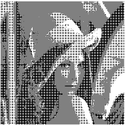
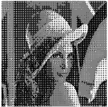

# Bagaimana Menentukan Pola Dari Patterning
# Bagaimana Menentukan Matrix Ditter, Treshold

# Mengapa Pola Dithering yang Kecil (2x2) Tidak Sebagus dengan yang Lebih Besar (4x4)

Citra  keluaran  dari  proses ordered dithering menunjukkan  kualitas  yang  lebih baik   dibandingkan   dengan   metode   ambang   batas (<i>thresholding</i>).   Perbedaan   antara keluaran  yang  dihasilkan antara citra  menggunakan  2x2  matriks dithering dan  4x4 matriks dithering terletak pada sensitifitas nilai pixel aslinya. Citra yang dihasilkan dari penggunaaan matriks 2x2 memiliki pola halftone yang kurang dibandingkan dengan citra yang diproses menggunakan matriks dithering 4x4. Karena itu hasil dari citra dengan 2x2 matriks dithering memiliki  banyak  daerah  dengan  pola  yang  sama,  seperti  pada  bagian latar belakang, rambut, dan hidung, meskipun pada daerah ini mengandung lebih banyak jenis nilai pixel.

Gambar dengan matrix dithering 2x2

Gambar dengan matrix dithering 4x4
