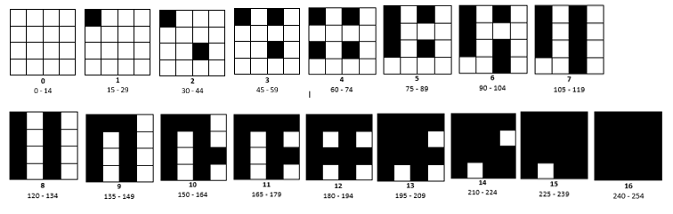
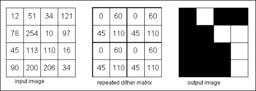
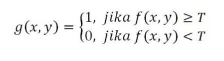

# Bagaimana Menentukan Pola Dari Patterning

Patterning adalah salah satu teknik sederhana untuk mendigitalisasi halftoning dengan merubah ukuran pixelnya. Misal yang awalnya berukuran 2x2, maka ketika dilakukan patterning ukurannya jadi berubah dimana setiap 1 pixel menjadi ukuran 2x2, maka ukuran akhirnya yang awalnya 2x2 menjadi 4x4. 

Untuk menentukan banyaknya pola patterning, dapat kita hitung secara langsung dengan menghitung font binner nya kemudian ditambah 1. 
<i>Contoh: </i>Jika terdapat font binner 4x4, maka banyaknya pola yang didapat adalah (4x4)+1 = 17. 
Artinya, untuk pola paterning 4x4 ada sebanyak 17 pola yang berbeda. Sekarang pertanyaannya, bagaimana membedakan pola-pola tersebut? 
Jawabannya adalah dengan menggunakan probabilitas. Pola pada patterning tidak boleh sama, dan pola yang sudah ada dan ketika posisinya diputar-putar menghasilkan pola yang sama, juga tidak boleh digunakan lagi. Sehingga terkadang patterning yang dihasilkan bisa berbeda-beda setiap orang, karena mungkin saja tiap orang berbeda membuat pola untuk patterningnya.

Pola Patterning 4x4

Untuk menentukan batas tiap pola dapat kita hitung dengan cara jumlah warna dibagi banyaknya pola = 256 / 17 = 15,05, kita bulatkan menjadi 15. 
Artinya, setiap pola memiliki rentang 15 angka yang dimulai dari angka 0.

# Bagaimana Menentukan Matrix Ditter, Treshold

Teknik halftoning lainnya itu dithering. Berbeda dengan patterning, dithering membuat gambar keluaran dengan jumlah titik yang sama dengan jumlah pixel pada gambar aslinya. Dithering dilakukan  dengan  membandingkan  tiap  blok  dari  citra  asli dengan sebuah matriks  pembatas  yang  disebut  dengan <i>matriks dither</i>. Masing-masing elemen  dari  blok  asli  dikuantisasi  sesuai  dengan  nilai  batas  pada  pola dither.  Nilai-nilai pada matriks dither adalah tetap, tetapi bisa bervariasi sesuai dengan jenis citra. Dalam proses dithering, ketika dibandingkan nilai dari tiap matrix dither dengan nilai dari gambar asli <b> kurang dari batas </b>maka akan diberi warna putih, sebaliknya jika <b>lebih dari batas</b> maka akan diberi warna hitam. 

Matriks  tersebut (matriks dither)  diulang  sampai  mencakup  seluruh  matriks  pada  citra  yang  diolah. Katakanlah  d(i,j)  adalah  matriks  yang  diperoleh  dari  mereplika  A  dan  x(i,j)  adalah  citra abu-abu asli. Pixel untuk citra yang dihasilkan p(i,j) didefenisikan sebagai berikut:

        Keterangan:
        255 sama saja dengan 1. Merepresentasikan warna hitam.
        0 merepresentasikan warna putih.
        

# Mengapa Pola Dithering yang Kecil (2x2) Tidak Sebagus dengan yang Lebih Besar (4x4)

Citra  keluaran  dari  proses ordered dithering menunjukkan  kualitas  yang  lebih baik   dibandingkan   dengan   metode   ambang   batas (<i>thresholding</i>).   Perbedaan   antara keluaran  yang  dihasilkan antara citra  menggunakan  2x2  matriks dithering dan  4x4 matriks dithering terletak pada sensitifitas nilai pixel aslinya. Citra yang dihasilkan dari penggunaaan matriks 2x2 memiliki pola halftone yang kurang dibandingkan dengan citra yang diproses menggunakan matriks dithering 4x4. Karena itu hasil dari citra dengan 2x2 matriks dithering memiliki  banyak  daerah  dengan  pola  yang  sama,  seperti  pada  bagian latar belakang, rambut, dan hidung, meskipun pada daerah ini mengandung lebih banyak jenis nilai pixel.

Gambar dengan matrix dithering 2x2

Gambar dengan matrix dithering 4x4
