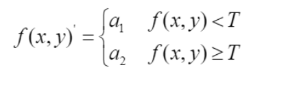
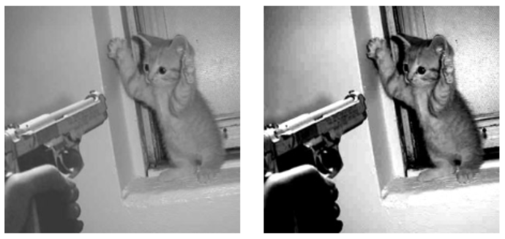
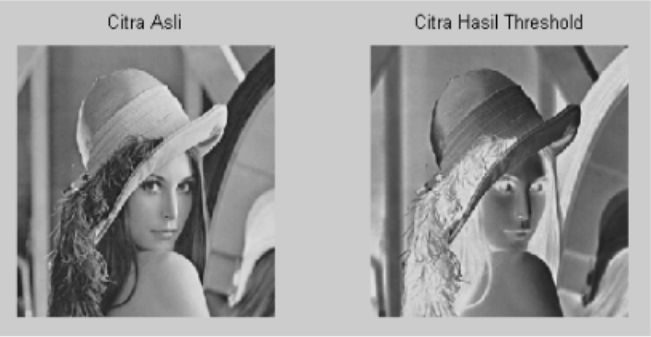
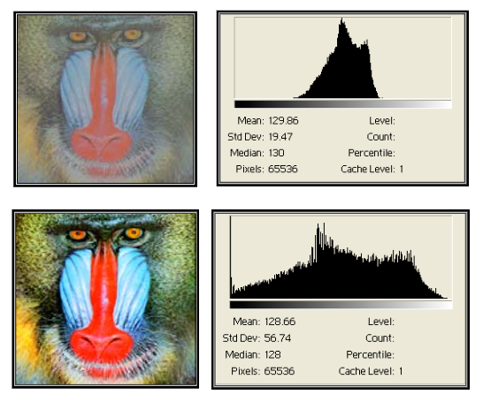
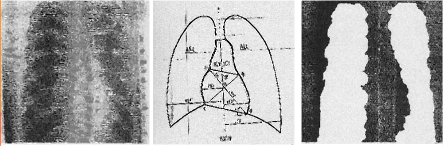
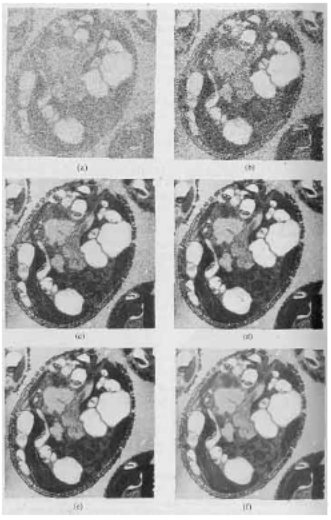
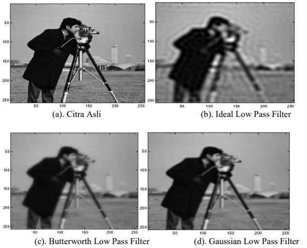

|  Nama | NIM | Tugas |
| :------------------:| :--------------:| :-----------------------------: |
| Risma Wulandari | 2110131220008 | Mengulas Spatial dan Frekuensi Domain |

<h1 align="center">SPATIAL AND FREQUENCY DOMAIN</h1>

<p align="justify">Seperti yang telah dikemukakan Gonzalez dalam bukunya Digital Image Processing (2002, 147), bahwa tujuan dari teknik peningkatan mutu citra adalah untuk melakukan pemrosesan terhadap citra agar hasilnya mempunyai kualitas relative lebih baik dari citra awal guna aplikasi tertentu. Kata baik disini tergantung dari jenis aplikasi dan problem yang diahadapi.</p>

<p>Perbaikan kualitas citra atau dikenal dengan image enhancement, dalam pengolahan citra digital dikenal sebagai tahap awal (pre-processing). Perbaikan kualitas citra sangat dibutuhkan disaat citra yang akan di olah mengalami penurunan terhadap kualitasnya. Citra yang terlalu terang atau gelap, citra kurang
tajam, adanya derau, citra kabur dan lain sebagainya adalah contoh citra yang terdegradasi.
Secara matematis, perbaikan kualitas citra (image enhancement) dengan kata lain dapat diartikan sebagai proses mentransformasikan citra f(x, y) ke f’(x, y) sehingga ciri-ciri yang dilihat pada f(x, y) lebih di tampakkan (Munir, 2004). Tahapan yang ada dalam perbaikan citra adalah:</p>

<h4>1. Pengubahan Kecerahan Gambar <i>(Image Brightness)</i></h4>
<h4>2. Peregangan Kontras <i>(Contrast Stretching)</i></h4>
<h4>3. Pengubahan Histogram Citra</i></h4>
<h4>4. Pelembutan Citra <i>(Image Smoothing)</i></h4>
<h4>5. Penajaman Citra <i>(Image Sharpening)</i></h4>
<h4>6. Pewarnaan Semu <i>(Pseudocoloring)</i></h4>
<h4>7. Koreksi Geometrik</i></h4>

<h3>Teknik peningkatan mutu citra dapat dibagi menjadi dua yaitu :</h3>

## 1. Peningkatan mutu citra pada ranah *Spatial Domain*

Pada domain spasial, teknik dalam pemrosesan gambar berdasarkan dalam
metode spasial bekerja secara langsung pada piksel-piksel gambar. Didalam metode domain spasial memodifikasi nilai-nilai piksel dari citra sesuai aturan yang tergantung dari nilai piksel asli dengan menerapkan operasi lokal ataupun titik. Metode dalam pemrosesan citra yang berdomain di ranah spasial dapat dinyatakan sebagai berikut:

``` Math
𝑔 (𝑥, 𝑦) = 𝑇[𝑓(𝑥, 𝑦)] . . . . .. . . . . . .. . . . . . . . . . . . . . (2.8)
```
Dimana f (x, y) adalah citra input, g (x, y) citra output dan T adalah operator terhadap f, dimana dapat beroperasi pada satu piksel (aras titik), piksel yang bertetangga (aras lokal) dan keseluruhan piksel dalam citra (aras global).

   - _Point Processing_

   Cara paling mudah untuk melakukan peningkatan mutu pada domain spasial adalah dengan melakukan pemrosesan yang hanya melibatkan satu piksel saja (tidak menggunakan jendela ketetanggaan). Pengolahan menggunakan histogram juga termasuk dalam bagian point processing. Operasi titik disebut juga operasi _pointwise_, yang terdiri dari pengaksesan pixel pada lokasi yg diberikan, memodifikasinya dengan operasi linier atau non linier, menempatkan nilai piksel baru pada lokasi yang bersesuaian di dalam citra yg baru.

   Operasi ini dapat dibagi menjadi 3 macam :
   1. Berdasarkan intensitas => Contrast stretching, Image Negative, Histogram equalization, Image Substration, Image Averaging.

* Contrast Stretching

> Didasarkan pada operasi pengambangan (thresholding). Operasi ini setiap pixel nilai intensitasnya dipetakan ke salah satu dari 2 nilai misal a1 dan a2, berdasarkan nilai ambang (threshold) T



> Contoh Contrast Stretching



* Image Negative

> Yaitu mendapatkan citra negatif meniru film negatif pada fotografi. Caranya dengan mengurangi nilai intensitas piksel dari nilai keabuan maksimum. Proses ini banyak digunakan pada citra medis seperti USG dan X-Ray. Contoh Image Negative



* Histogram Equalization

> Histogram equalization adalah suatu proses perataan histogram, dimana distribusi nilai tingkat keabuan pada suatu citra dibuat rata. Contoh Histogram Equalization



* Image Substration

> Dilakukan jika kita ingin mengambil bagian tertentu saja dari citra. Contoh Image Substraction



* Image Averanging

> Dilakukan jika kita memilikib eberapa citra yang bergambar sama, namun semua citra memiliki noise. Cara memperbaikinya adalah dengan melakukan operasi rata-rata terhadap semua citra tersebut. Contoh Image Averanging




   2. Berdasarkan geometri => Posisi pixel diubah ke posisi yg baru, sedangkan intensitasnya tidak berubah. Contoh : rotasi, translasi, penskalaan (dilatasi), distorsigeometri.

   3. Gabungan keduanya => Operasi ini tidak hanya mengubah nilai intensitas pixel, tapi juga mengubah posisinya. Misal: _image morphing_ yaitu perubahan bentuk objek beserta intensitasnya.
   
   
   - _Mask Processing_

   Jika pada point processing kita hanya melakukan operasi terhadap masing-masing piksel, maka pada mask processing kita melakukan operasi terhadap suatu jendela ketetanggaan pada citra. Kemudian kita menerapkan (mengkonvolusikan) suatu mask terhadap jendela tersebut. Masksering juga disebut filter. Filtering pada citra adalah suatu proses dimana diambil sebagian sinyal dari frekuensi tertentu dan membuang sinyal pada frekuensi yang lain.

   Contoh: Jendela ketetanggan 3x3, nilai piksel pada posisi x dipengaruhi oleh nilai 8 tetangganya.

   | 1 | 2 | 3 |
   |:----:| :----:| :----: |
   | 8 | X | 4 |
   | 7 | 6 | 5 |

   Perbedaan dengan point processing: pada point processing, nilai suatu piksel tidak dipengaruhioleh nilai tetangga-tetangganya.

   <h4>Prinsip-Prinsip Filtering:</h4>

   * Bila ingin mempertahankan gradiasi atau banyaknya level warna pada suatu citra, maka yg dipertahankan adalah frekuensi rendah dan frekuensi tinggi dapat dibuang atau dinamakan dengan _Low Pass Filter_. Banyak digunakan untuk reduksi noise dan proses blur.
   * Bila ingin mendapatkan _threshold_ atau citra biner yang menunjukkan bentuk suatu gambar maka frekuensi tinggi di pertahankan dan frekuensi rendah dibuang atau dinamakan dengan _High Pass Filter_. Banyak digunakan untuk menentukan garis tepi (edge) atau sketsa dari citra.
   * Bila ingin mempertahankan gradiasi dan bentuk, dengan tetap mengurangi banyaknya bidang frekuensi _(bandwidth)_ dan membuang sinyal yg tidak perlu maka frekuensi rendah dan frekuensi tingi dipertahankan, sedangkan frekuensi tengahan dibuang atau dinamakan dengan _Band Stop Filter_. Dikembangkan dengan menggunakan wavelet transform untuk proses kompresi, restorasi dan denoising.


## 2. Peningkatan mutu citra pada ranah *Frequency Domain*

Citra domain frekuensi merupakan citra hasil dari transformasi
fourier dimana nilai pikselnya adalah nilai pada frekuensi tertentu. Citra domain spasial ditransformasikan ke domain frekuensi menggunakan transformasi Fourier. Citra dalam domain frekuensi dioperasikan dengan fungsi filter kemudian ditransformasikan kembali ke domain spasial menggunakan Inverse Fourier Transform akan diperoleh citra hasil. Berbagai detail pada citra seperti tepian dan noise adalah hasil dari frekuensi tinggi, sedangkan frekuensi rendah berdampak pada tampilan citra yang smooth atau blur. Filter yang melewatkan frekuensi rendah dan menahan frekuensi tinggi disebut _Low Pass Filter_ dan sebaliknya untuk _High Pass Filter_. Dalam teknik domain frekuensi, peningkatan kualitas citra dilakukan dengan cara memanipulasi koefisien transformasi yang memungkinkan operasi pada konten frekuensi citra, maka konten yang berfrekuensi tinggi seperti tepi, batas maupun informasi lainnya dengan mudah bisa dideteksi dan ditingkatkan. Contoh metode pada domain frekuensi seperti tapis rendah, tapis tinggi, dan homomorfik.

* Low Pass Filter

Terdapat tiga tipe low pass filter yang disimulasikan yakni (i) Ideal, (ii) Butter worth, dan (iii) Gaussian filter. Low pass filter digunakan untuk _smoothening (blurring)_ dengan menahan komponen frekuensi tinggi. Berikut adalah citra dengan Ideal, Butterworth dan Gausian filter. 



* High Pass Filter

High Pass filter merupakan kebalikan dari operasi Low Pass Filter. Terdapat tiga tipe filter yang akan disimulasikan yakni (i) Ideal, (ii) Butterworth, dan (iii) Gaussian filter. High Pass filter digunakan untuk menajamkan citra dengan menahan komponen frekuensi rendah. Butterworth high pass filter menyediakan transisi dari penajaman Ideal High Pass filter ke Gaussian High Pass Filter seperti terlihat pada gambar 8 (a), (b), (c) dan (d).

