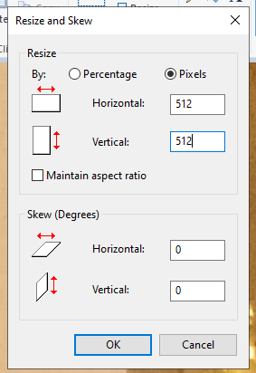
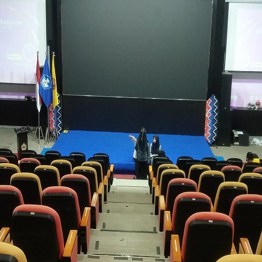
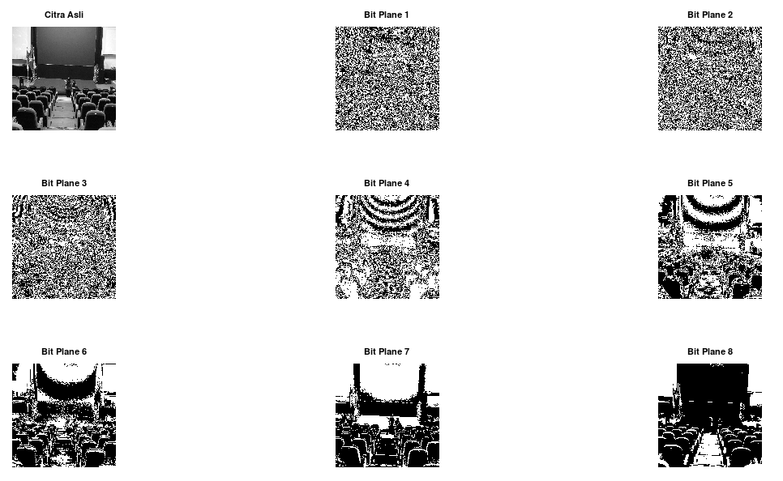
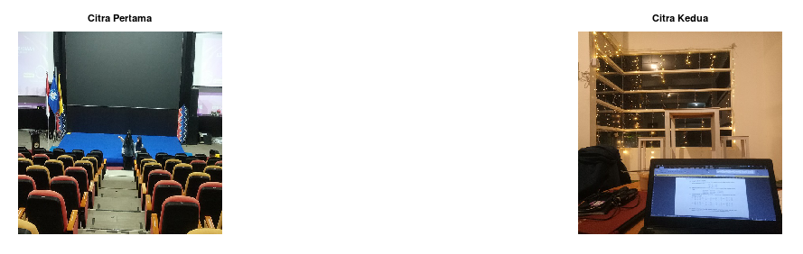
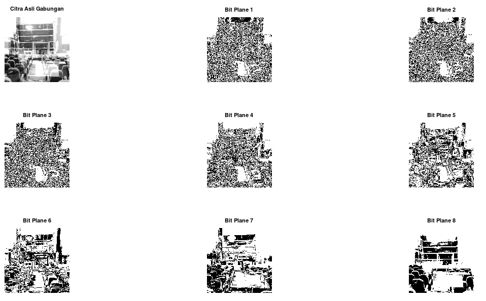
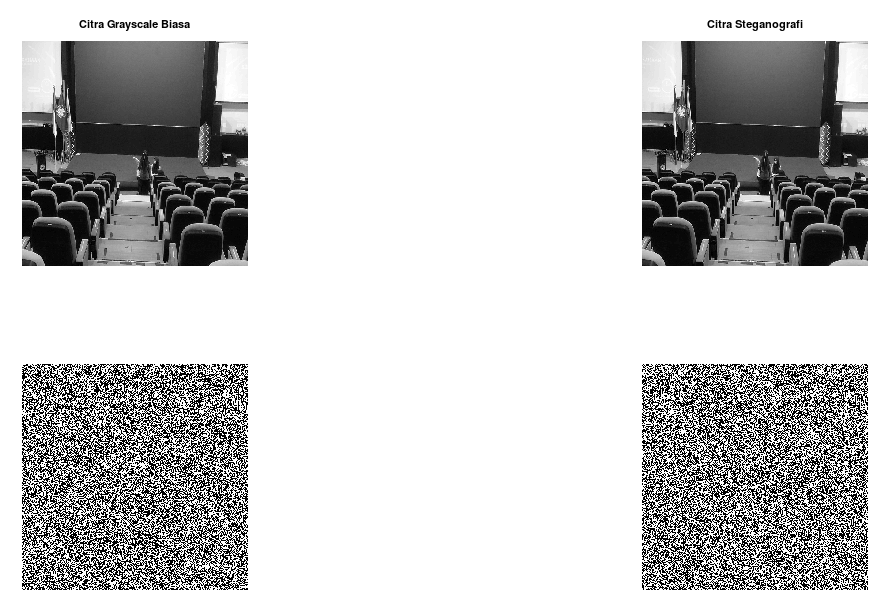

## Nama : Risma Wulandari
## NIM : 2110131220008

<br><h1 align="center">Tugas Bit Plane Slicing dan Steganografi</h1>

## 1. Eksperimen dengan gambar sendiri
<p align="justify">Pertama, ubah citra yang kita punya menjadi ukuran 512 x 512 pixel.</p>
<p align="center"></p>
<p align="justify">Sehingga hasil citra yang diperoleh seperti gambar dibawah.</p>
<p align="center"></p>

<p align="justify">Selanjutnya, kita akan melakukan Bit-Plane Slicing. Untuk code nya bisa dilihat dibawah.</p>

```Octave
img = imread('img\img1.jpg');

% mengubah citra rgb ke grayscale
R = img(:,:,1);
G = img(:,:,2);
B = img(:,:,3);

gray_img = (0.3*R) + (0.59*G) + (0.11*B);
subplot(3, 3, 1) ; imshow(gray_img) ; title("Citra Asli");

% menampilkan setiap bit slicing dengan fungsi bitget
figure(1);
for i = 1:8
  bit_img = bitget(gray_img, i);
  subplot(3, 3, i+1) ; imshow(bit_img); title(["Bit Plane ", num2str(i)]);
end
```

<p align="justify">Output yang diperoleh berdasarkan code diatas adalah:</p>
<p align="center"></p>

## 2. Eksperimen dengan gambar teman
<p align="justify">Jika tadi bereksperimen hanya dengan satu citra, maka kali ini kita akan menggabungkan dua citra dan melihat Bit-Plane Slicingnya. Pertama, ubah kedua citra yang kita punya menjadi ukuran 512 x 512 pixel. Untuk caranya sama seperti yang diawal tadi.</p>
<p align="center"></p>
<p align="justify">Selanjutnya, kita akan melakukan Bit-Plane Slicing lagi untuk citra gabungan ini. Untuk code nya bisa dilihat dibawah.</p>

```Octave
pkg load image

img1 = imread('img\img1.jpg');
img2 = imread('img\img2.jpg');

% menggabungkan dua buah citra
gabungan = imadd(img1, img2);

% mengubah citra rgb ke grayscale
R = gabungan(:,:,1);
G = gabungan(:,:,2);
B = gabungan(:,:,3);

gray_img = (0.3*R) + (0.59*G) + (0.11*B);
subplot(3, 3, 1) ; imshow(gray_img) ; title("Citra Asli Gabungan");

% menampilkan setiap bit slicing dengan fungsi bitget
figure(1);
for i = 1:8
  bit_img = bitget(gray_img, i);
  subplot(3, 3, i+1) ; imshow(bit_img); title(["Bit Plane ", num2str(i)]);
end
```

<p align="justify">Output yang diperoleh berdasarkan code diatas adalah:</p>
<p align="center"></p>

## 3. Steganografi
<p align="justify"><b>Steganografi</b> adalah seni dan ilmu menulis pesan tersembunyi atau menyembunyikan pesan dengan suatu cara sehingga selain si pengirim dan si penerima, tidak ada seorang pun yang mengetahui atau menyadari bahwa ada suatu pesan rahasia.<br>
Kita akan menyisipkan Nama dan NIM kedalam suatu citra.<br>
Untuk code nya bisa dilihat dibawah ini.</p>

```Octave
pkg load image

img = imread('img\img1.jpg');
cover_img = rgb2gray(img);
[img_height, img_width] = size(cover_img);

% mengidentifikasi pesan yang akan dimasukkan
pesan = "Risma Wulandari 2110131220008";
panjang_pesan = length(pesan);

% menggunakan fungsi uint untuk mengambil ascii
ascii_pesan = uint8(pesan);

% mengambil nilai biner dari pesan_mengubah decimal ke binar
biner_pesan = dec2bin(ascii_pesan, 8);  % ini mengembalikan menjadi string

% supaya jadi 1 baris aja, di transpose 2x
biner_pesan = transpose(biner_pesan);
biner_pesan = biner_pesan(:);
biner_pesan = str2num(biner_pesan);

% copy cover ke citra hasil
stego_img = cover_img;

% tranverse cover img
counter = 1;

for x = 1:img_height
  for y = 1:img_width
    if (counter <= panjang_pesan)
      LSB = bitget(stego_img(x,y), 1);
      BPS = biner_pesan(counter);
      temp = xor(LSB, BPS);
      stego_img(x,y) = cover_img(x,y) + temp;
      counter = counter + 1;
    else
      break;
    end
  end
end

% simpan gambar
imwrite(stego_img, "stego.png")

lsb_before = bitget(cover_img, 1);
lsb_after = bitget(stego_img, 1);

subplot(2,2,1); imshow(cover_img);title("Citra Grayscale Biasa");
subplot(2,2,2); imshow(stego_img);title("Citra Steganografi");
subplot(2,2,3); imshow(lsb_before);
subplot(2,2,4); imshow(lsb_after);
```

<p align="justify">Output yang diperoleh berdasarkan code diatas adalah:</p>
<p align="center"></p>